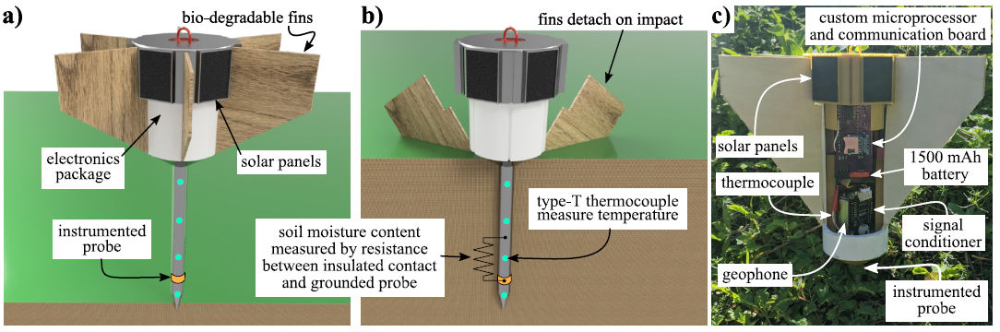

# In-Situ-Water-Quality-Sensor
An in situ water quality sensor for monitoring water quality

   
The in situ water quality system under development.Kyle, can you add a figure here. 

## [System Design](System_design)
The system (hardware and software) design for the project.

