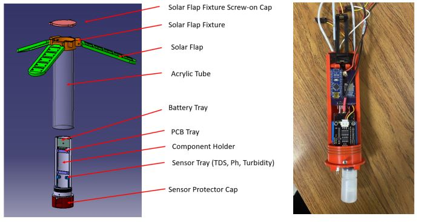
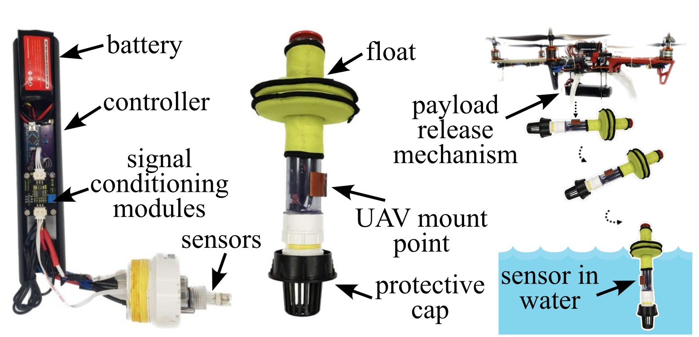

# In-Situ-Water-Quality-Sensor
An in situ water quality sensor for monitoring water quality from a UAV-deployable sensor package. The sensor packages provide real-time monitoring of pH, conductivity, temperature, and turbidity. 

   
An early configuration of the proposed UAV-deployable in situ water quality system with pedal-style solar panels. 

   
System configuration as of August 2023 used for testing UAV deployments. 

## [System Design](system_design)
The system (hardware and software) design for the project.

## Licensing and Citation

This work is licensed under a Creative Commons Attribution-ShareAlike 4.0 International License [cc-by-sa 4.0].

Cite this data as: 

#### Bibtex

@Misc{ARTSLabSituWaterQuality, 
  author = {ARTS-Lab}, 
  title  = {In-Situ-Water-Quality-Sensor}, 
  groups = {ARTS-Lab}, 
  url    = {https://github.com/ARTS-Laboratory/In-Situ-Water-Quality-Sensor}, 
} 

