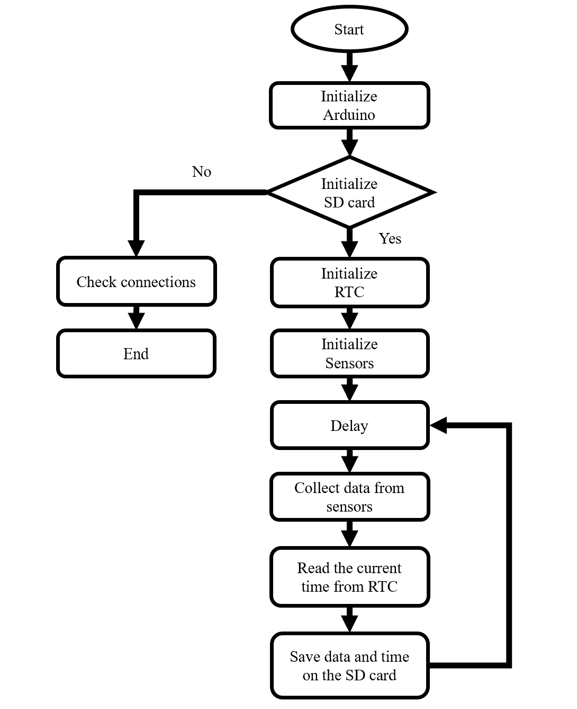
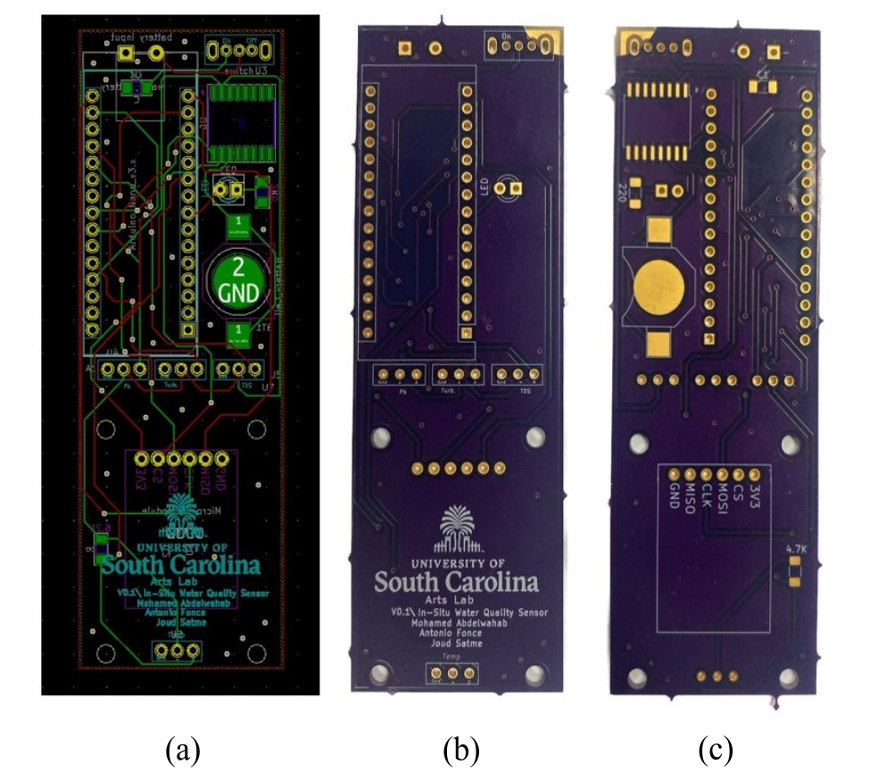
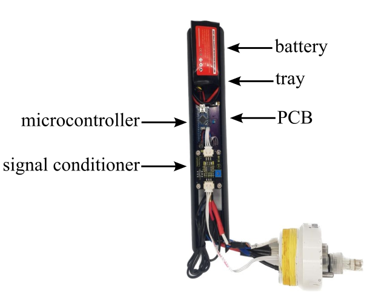

# in-Situ Water Quality Sensor Package system design
V0.4.6 system design includes:

Figure 1: Sensor package mission algorithm breakdown.

Figure 2: (a) Designed Footprints of the PCB, (b) The Front Side of the PCB, and
 (c) Back Side of the PCB.

Figure 3: The tray that holds the sensor package's internal components.

